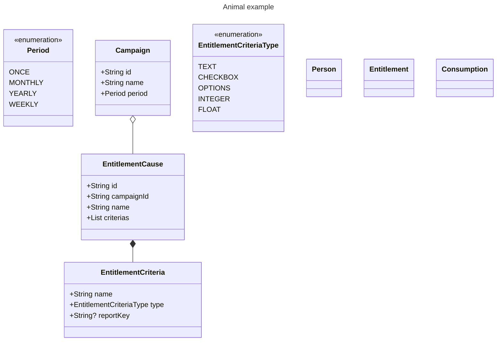

# Class diagram

    Kampagne: Campaign
    Ansuchgrund: Entitlement Cause
    Anspruchsberechtigung: Entitlement
    Anspruchsberechtigte: Entitled Person
    Bezug / Inanspruchnahme: Consumption / utilization
    Bezugsberechtigung (BB): Consumption Permission

